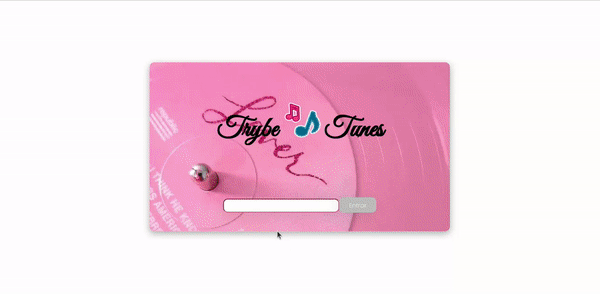

## 🎶 Projeto TrybeTunes 🎶 

Projeto desenvolvido no módulo de Front-end do curso da [Trybe](https://www.betrybe.com/).
Foi implementado o aplicativo TrybeTunes sendo ele feito com React, React Router. Usando a API do Apple Music para obter capas, títulos e listas de faixas dos álbuns! Ao utilizar essa aplicação uma pessoa usuária é capaz de:

- Fazer login;
- Pesquisar por uma banda ou artista;
- Listar os álbuns disponíveis dessa banda ou artista;
- Visualizar as músicas de um álbum selecionado;
- Reproduzir uma prévia das músicas deste álbum;
- Favoritar e desfavoritar músicas;

## 🚀 Tecnologias
Esse projeto foi desenvolvido com as seguintes tecnologias:

- HTML
- CSS
- Javascript
- React

## 📌 Habilidades

Nesse projeto, fui capaz de:

- Fazer requisições e consumir dados vindos de uma API;
- Utilizar os ciclos de vida de um componente React;
- Utilizar o componente BrowserRouter corretamente;
- Criar rotas, mapeando o caminho da URL com o componente correspondente, via Route;
- Utilizar o Switch do React Router
- Criar links de navegação na aplicação com o componente Link;

  

